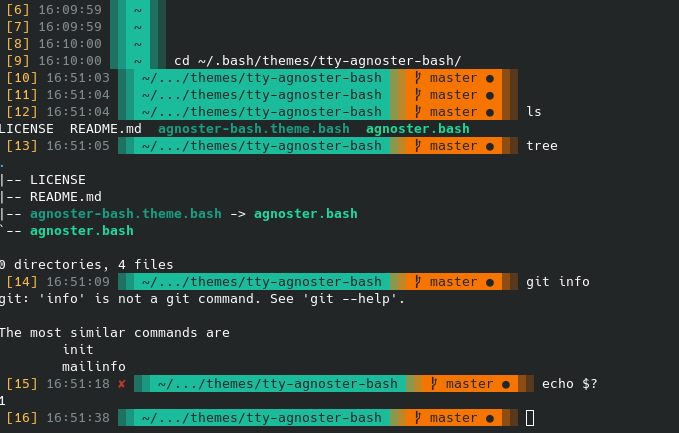

# tty-agnoster-bash

Agnoster Theme for Bash that works at evil TTY (1-6).
A Powerline-inspired theme for BASH.

https://wiki.archlinux.org/title/User:Grufo/Color_System's_Bash_Prompt



# Origins

* ZSH Аgnoster's Theme
    * https://gist.github.com/3712874
* Converted from ZSH theme _[by Kenny Root]_
    * https://gist.github.com/kruton/8345450
* As original see agnoster-bash _[by Erik Selberg]_
    * https://github.com/speedenator/agnoster-bash
* Converted for TTY by @w495
    * https://github.com/w495/tty-agnoster-bash

Also See alternative `agnoster_bash` _[by H@di]_
→ https://github.com/hadisfr/agnoster_bash

# CHANGES

* TTY-compatible sympols for separator (▒░);
* Time section to the beging of prompt line.

# USAGE

Recommend installation:

```bash
cd ${HOME};
mkdir -p .bash/themes/tty-agnoster-bash;
git clone https://github.com/w495/tty-agnoster-bash.git .bash/themes/tty-agnoster-bash
```

then add the following to your .bashrc:

```bash

export THEME=$HOME/.bash/themes/tty-agnoster-bash/tty-agnoster.bash
if [[ -f $THEME ]]; then
    source $THEME -u "$(whoami)" -s '🭬'
fi
```
